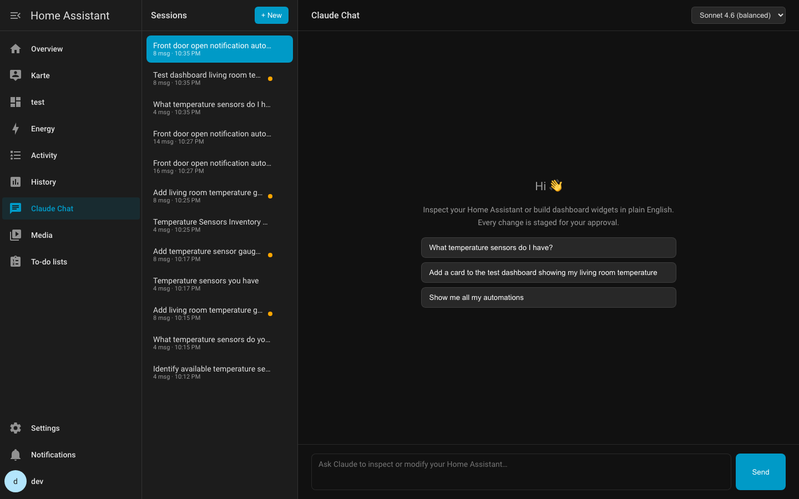
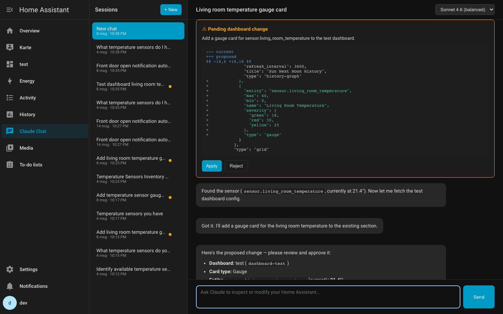
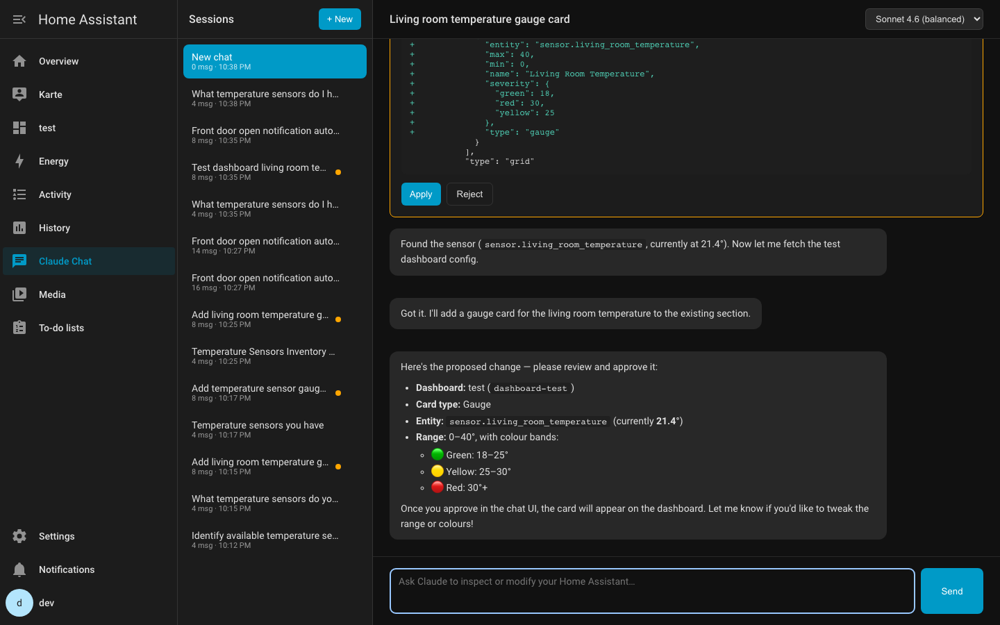
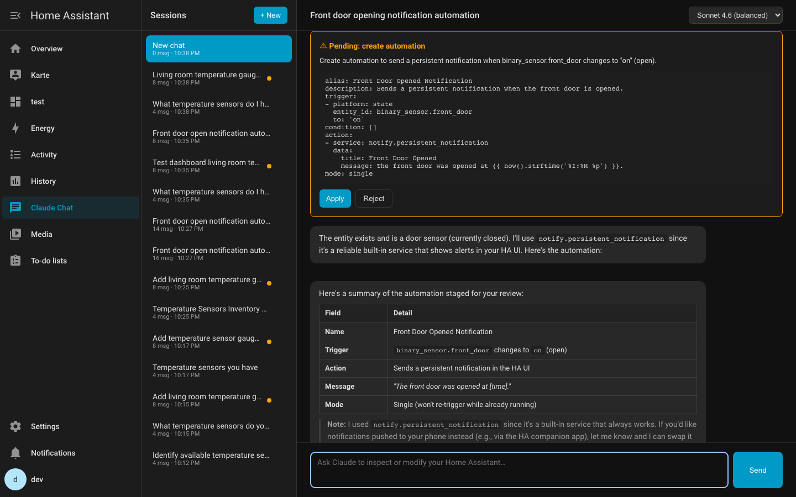
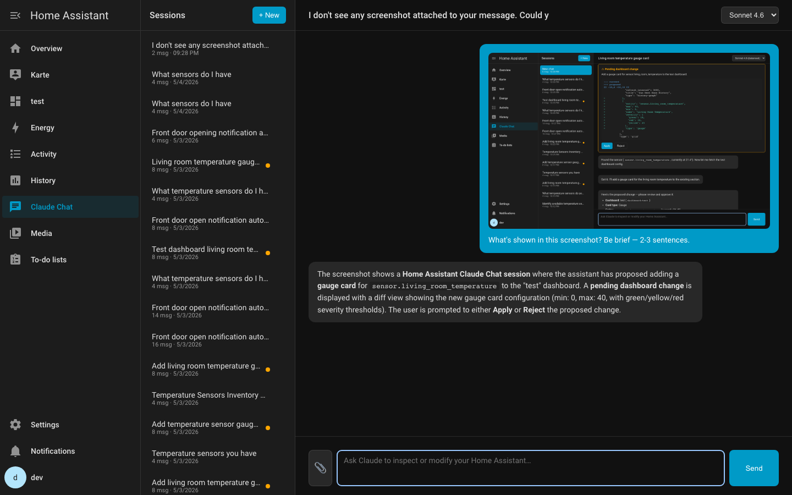

# Claude Chat for Home Assistant

[](https://github.com/hacs/integration)

> ⚠ **Alpha — usable, feedback welcome.** This is a new integration; please run it on a non-critical instance for now and open issues for anything unexpected. End-to-end flows are covered by tests and live verification, but it hasn't yet had time to soak in the community.
>
> *Unofficial community integration. Not affiliated with or endorsed by Anthropic. "Claude" is a trademark of Anthropic, used here descriptively to identify the supported model.*

A sidebar chat panel powered by Anthropic's Claude. Ask Claude to inspect your Home Assistant or build dashboard widgets in plain English. Every dashboard edit is staged and shown as a diff so you can approve or reject before anything is saved.

## Screenshots

**Empty state with example prompts and model picker**


**Asking about sensors — markdown tables, collapsible tool calls, auto-titled sessions**


**Reviewing a proposed dashboard change — full unified diff, Apply or Reject before anything is saved**


**…with a natural-language summary of the change below the diff**


**Creating an automation — Claude generates the YAML, you Apply to write to `automations.yaml` and reload**


**Dragging an image into the composer — Claude can see it (screenshots, photos of device labels, wiring diagrams)**


## What it does

- Adds a **Claude Chat** entry to the HA sidebar.
- Multiple persistent chat sessions, auto-titled after the first message (like ChatGPT).
- Streaming responses over HA's websocket — markdown, code blocks, and tables render live as Claude types.
- Model picker per session (Haiku / Sonnet / Opus); the choice is remembered.
- **Stop** button to cancel a streaming response mid-flight.
- Claude has a small, scoped set of HA tools:
  - `list_entities`, `get_entity`, `list_areas`
  - `list_dashboards`, `get_dashboard`, `list_lovelace_resources`
  - `list_automations`, `get_automation`, `list_services`
  - **Debugging**: `list_automation_traces`, `get_automation_trace`, `get_state_history` — ask *"why didn't my X automation fire yesterday"* and Claude pulls the trace, reads the conditions/triggers, and explains
  - `propose_dashboard_update`, `propose_service_call`,
    `propose_automation_create`, `propose_automation_update`,
    `propose_automation_delete` — all **stage** changes for your approval
- Dashboard edits show a unified diff. Service calls show the payload. Automations show the YAML. Nothing is applied without you clicking **Apply**.

## Examples

- *"What temperature sensors do I have?"*
- *"Add a card to the test dashboard with my living-room temperature."*
- *"Make a stack of 3 gauge cards for the upstairs sensors."*
- *"Turn off all the lights in the bedroom."* (proposes a `light.turn_off` service call for approval)
- *"Create an automation that notifies me when the front door opens."* (proposes new YAML for `automations.yaml`)
- *"Why didn't my bathroom-light automation trigger last night?"* (reads the recent traces, finds the failing condition, explains)
- *"Show me when the front door sensor changed in the last 24 hours."*

## Installation (HACS)

1. HACS → Integrations → ⋮ → Custom repositories → add this repo, category "Integration".
2. Install **Claude Chat**.
3. Restart Home Assistant.
4. Settings → Devices & Services → **Add Integration** → search "Claude Chat".
5. Paste your Anthropic API key (get one at [console.anthropic.com](https://console.anthropic.com)).

## How it works

```
┌──────────────────┐     ws      ┌────────────────────┐     https     ┌────────────┐
│ Sidebar panel    │ ─────────►  │ custom_components/ │ ────────────► │ Anthropic  │
│ (claude-chat-    │             │   claude_chat      │               │ API        │
│  panel.js)       │ ◄─ stream ─ │   (Python)         │ ◄── stream ── │            │
└──────────────────┘             └────────────────────┘               └────────────┘
                                          │
                                          ▼
                                  HA tools: states, areas,
                                  Lovelace storage, services
```

The integration runs Claude with [tool use](https://docs.anthropic.com/claude/docs/tool-use). When Claude wants to read your entities, modify a dashboard, or call a service, it calls a tool; the integration runs it against HA's internals; the result goes back to Claude. Mutating tools (`propose_*`) **stage** changes the user must approve in the UI before they hit storage or trigger services.

## Limitations / not yet supported

- YAML-mode dashboards are read-only (HA can't edit YAML files programmatically from a running integration).
- Auto-generated default dashboards work — they're materialised in storage on first save.
- **Automations**: create / update / delete is supported — Claude writes to `automations.yaml` and triggers `automation.reload`. Requires the default `automation: !include automations.yaml` line in `configuration.yaml`. Storage-mode-only automations (created in the UI without a YAML backing) are not yet supported for editing.
- No support yet for: scene/script creation, energy config.
- Live HA state changes don't stream into the chat (Claude only sees what tools fetch when called).
- Single integration instance only.

## Privacy

The integration sends prompts and the **result of any tool calls Claude makes** (entity lists, dashboard configs, etc.) to Anthropic's API over HTTPS. It does not stream your full HA state — only what tools fetch. Sessions are stored locally in HA's `.storage/claude_chat.sessions`.

## Development

```bash
make setup           # creates .venv with HA core + test deps
make test            # runs pytest (mocked Anthropic API, no tokens spent)
make ha-up           # local HA in Docker at http://localhost:8123
make ha-logs
```

See [dev/README.md](dev/README.md) for details on the dev container (auth bypass, pre-seeded sensors, hot-reload). End-to-end UI tests via Playwright: `.venv/bin/python dev/scripts/screenshots.py`.

## License

See [LICENSE](LICENSE).
